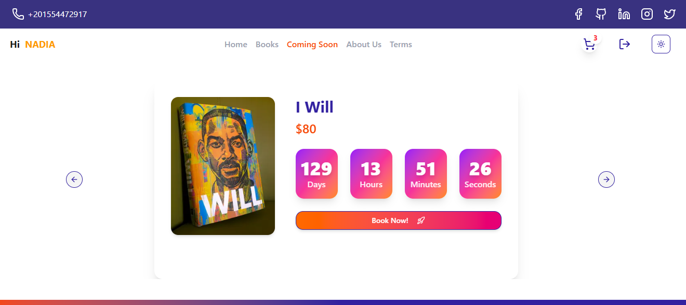
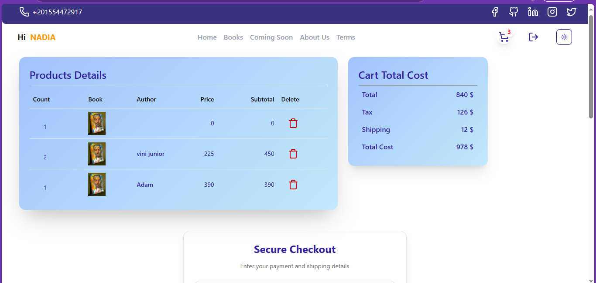
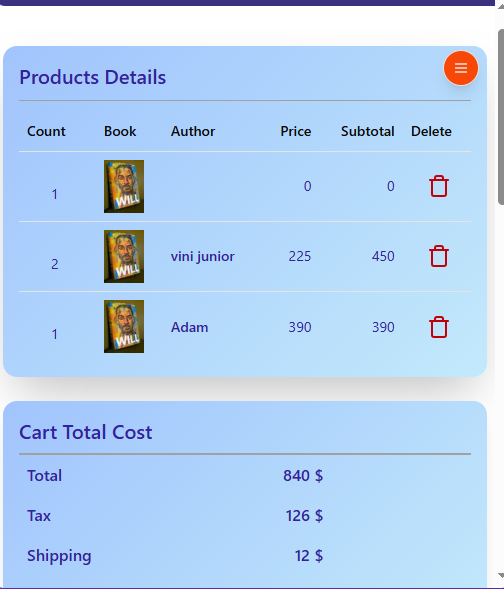
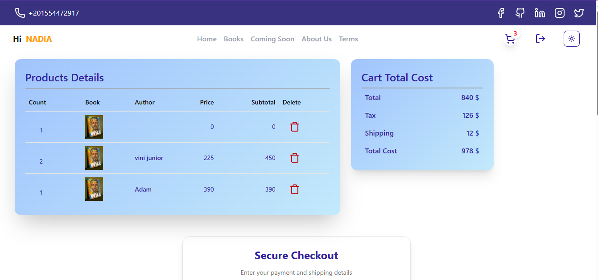

# 📚 Redify - Online Book Store

A modern, full-stack e-commerce platform for book lovers built with Next.js 15, featuring secure authentication, shopping cart functionality, and seamless payment processing.

## ✨ Features

### 🔐 Authentication & Security
- **NextAuth.js Integration** - Secure user authentication with JWT tokens
- **Role-based Access Control** - Customer, Admin, and Seller roles
- **Password Recovery** - Forgot password and reset functionality
- **Session Management** - Secure session handling with refresh tokens

### 🛒 Shopping Experience
- **Product Catalog** - Browse books with detailed information
- **Shopping Cart** - Add/remove items with real-time updates
- **Book Details** - Comprehensive product pages with descriptions
- **Search & Filter** - Find books by category, author, or title

### 💳 Payment Processing
- **Stripe Integration** - Secure payment processing
- **Multiple Payment Methods** - Credit/debit card support
- **Order Management** - Complete checkout flow with order tracking
- **Address Management** - Shipping address collection

### 🎨 Modern UI/UX
- **Responsive Design** - Works seamlessly on all devices
- **Dark/Light Theme** - Toggle between themes
- **Smooth Animations** - Framer Motion for delightful interactions
- **Loading States** - User-friendly loading indicators

## 🚀 Tech Stack

### Frontend
- **Next.js 15** - React framework with App Router
- **TypeScript** - Type-safe development
- **Tailwind CSS** - Utility-first CSS framework
- **Framer Motion** - Animation library
- **React Hook Form** - Form handling with validation
- **Zod** - Schema validation
- **Shadcn** - UI library

### Backend & APIs
- **NextAuth.js** - Authentication framework
- **Server Actions** - Server-side data fetching
- **RESTful API** - External book store API integration

### Payment & State Management
- **Stripe** - Payment processing
- **TanStack Query** - Server state management
- **React Query** - Data fetching and caching

### Development Tools
- **ESLint** - Code linting
- **TypeScript** - Static type checking
- **Vercel** - Deployment platform

## 🛠️ Installation

### Prerequisites
- Node.js 18+ 
- npm or yarn
- Git

### Setup Instructions

1. **Clone the repository**
   ```bash
   git clone https://github.com/yourusername/redify.git
   cd redify
   ```

2. **Install dependencies**
   ```bash
   npm install
   ```

   ```

4. **Run the development server**
   ```bash
   npm run dev
   ```

5. **Open your browser**
   Navigate to [http://localhost:3000](http://localhost:3000)

   

## 📁 Project Structure

```
src/
├── app/                    # Next.js App Router
│   ├── (dashboard)/       # Dashboard layout
│   ├── api/               # API routes
│   ├── auth/              # Authentication pages
│   └── dashboard/         # Main application pages
├── components/            # Reusable UI components
│   └── ui/               # Shadcn/ui components
├── lib/                  # Utility functions and configurations
│   ├── actions/          # Server actions
│   ├── forms/            # Form schemas and components
│   ├── providers/        # Context providers
│   └── types/            # TypeScript type definitions
└── middleware.ts         # Next.js middleware
```

## Screenshots










## 🔧 Configuration

### Authentication Setup
The app uses NextAuth.js with credentials provider. Configure your authentication in `src/auth.ts`:


### API Integration
Update the API endpoint in your environment variables to connect to your backend:

```env
API=https://upskilling-egypt.com:3007/api
```

## 🚀 Deployment

### Vercel (Recommended)
https://redifyy.vercel.app/

1. **Connect your repository to Vercel**
2. **Set environment variables** in Vercel dashboard:
   - `NEXTAUTH_URL` - https://redifyy.vercel.app/
   - `NEXTAUTH_SECRET`-pk_test_51Rzb4zCOiEjbFq7dLnouInOiXpXlU4rtP9AsEJn5vkGfXtjTerfdu3edQ3bJbXL0JK8KwHV6mQP1zN0Gtp0HzqqI00mTBNT89f
   - `API` -(https://upskilling-egypt.com:3007/api)

3. **Deploy**
   ```bash
   vercel --prod
   ```


## 🤝 Contributing

We welcome contributions! Please follow these steps:

1. **Fork the repository**
2. **Create a feature branch**
   ```bash
   git checkout -b feature/amazing-feature
   ```
3. **Commit your changes**
   ```bash
   git commit -m 'Add some amazing feature'
   ```
4. **Push to the branch**
   ```bash
   git push origin feature/amazing-feature
   ```
5. **Open a Pull Request**


## 📞 Support

If you have any questions or need help, please:
- Open an issue on GitHub
- Contact us at ramyesam701@gmail.com

---

Made with ❤️ by Ramy Essam